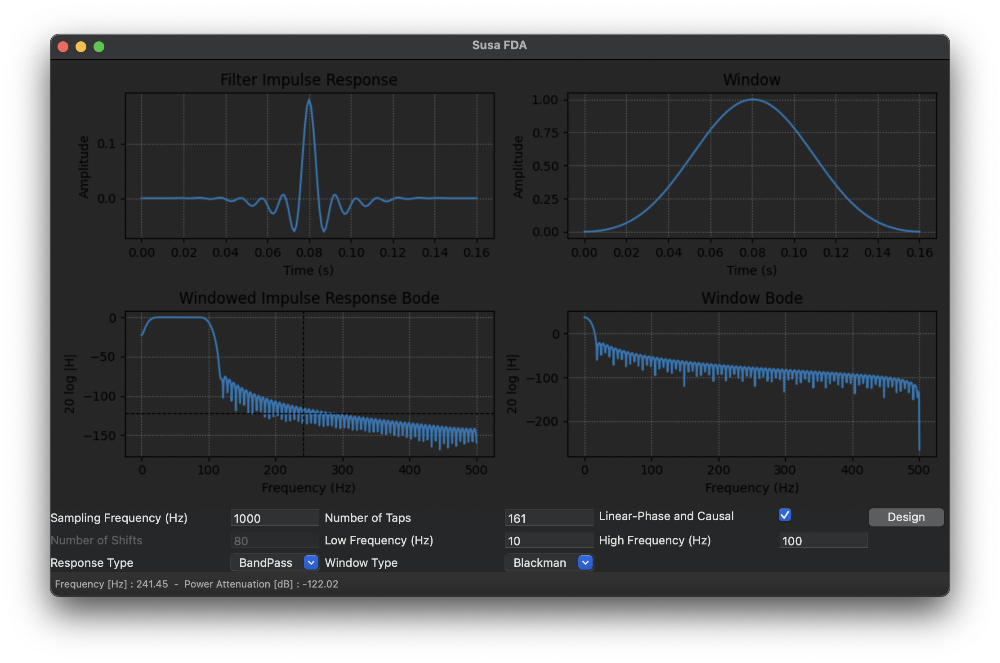

# Susa Filter Design and Analysis (FDA)
Susa FDA is an analog and digital filter design and analysis software written in Python 3. It provides filter response visualization and parametrization for faster and more reliable results.

</img>
# Development
Run the following sequence of commands on a terminal emulator
```bash
source run.sh
sfda_env
sfda_activate
sfda_reqs
sfda_run
```
